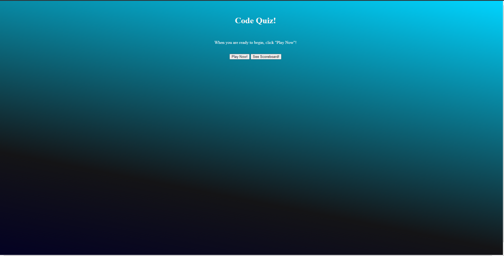
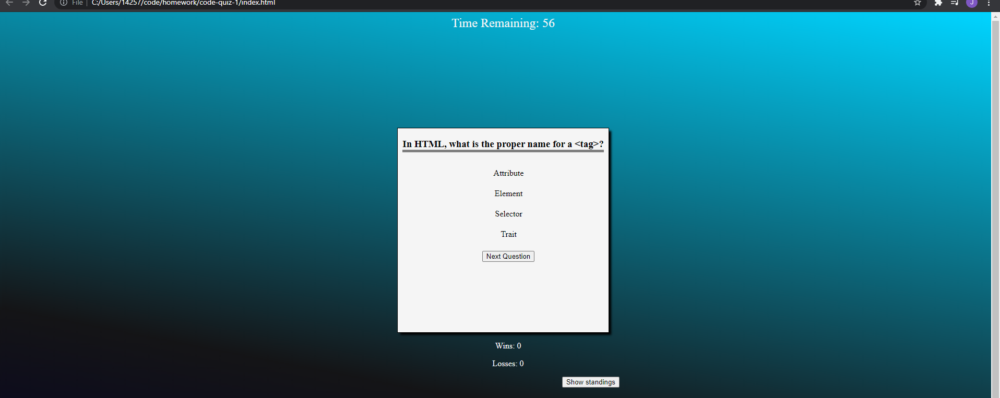
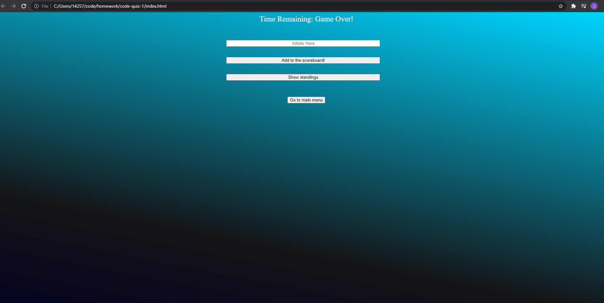
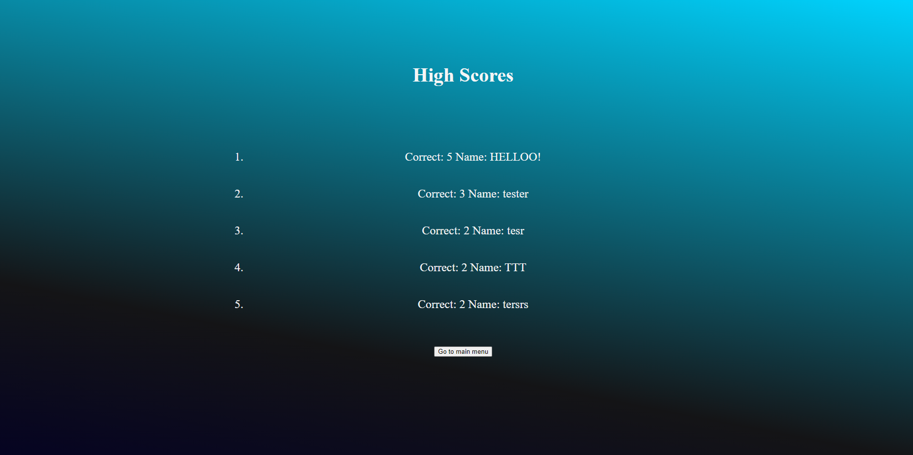

# Code Quiz

## Summary
This quiz consists of five questions to start, but because of the question structure, can be very easily updated with further questions. Once a user clicks the play now button, the quiz begins and a timer starts counting down. With each correct answer a win is awarded and with an incorrect answer, a bit of time is subtracted from the countdown and a loss is recorded. Once the user completes the quiz, they can log their scores with a set of initials *(maximum characters is currently 5) and view a record (scoreboard) consisting of the top 5 scores ranked by number! In the event that a user runs out of time, the game brings them to the score registration page and allows them the option to begin again. 

Alternatively, a user can select to immediately view the high score screen by clicking a coresponding button on our start page.

## Below...
- Issues with the application
- Screenshots of each portion of the application
- Github links, Repo and Deploy

### Issues I ran into:

- Current formating isn't quite how I wanted it, with certain breakpoints completely altering the layout

- Styling the scoreboard was more difficult than expected, would like to change to a table element in future iterations/redo's

### Screenshots

### Links

- Github Deploy: https://atlas238.github.io/code-quiz-1/

- Github Repo: https://github.com/Atlas238/code-quiz-1

